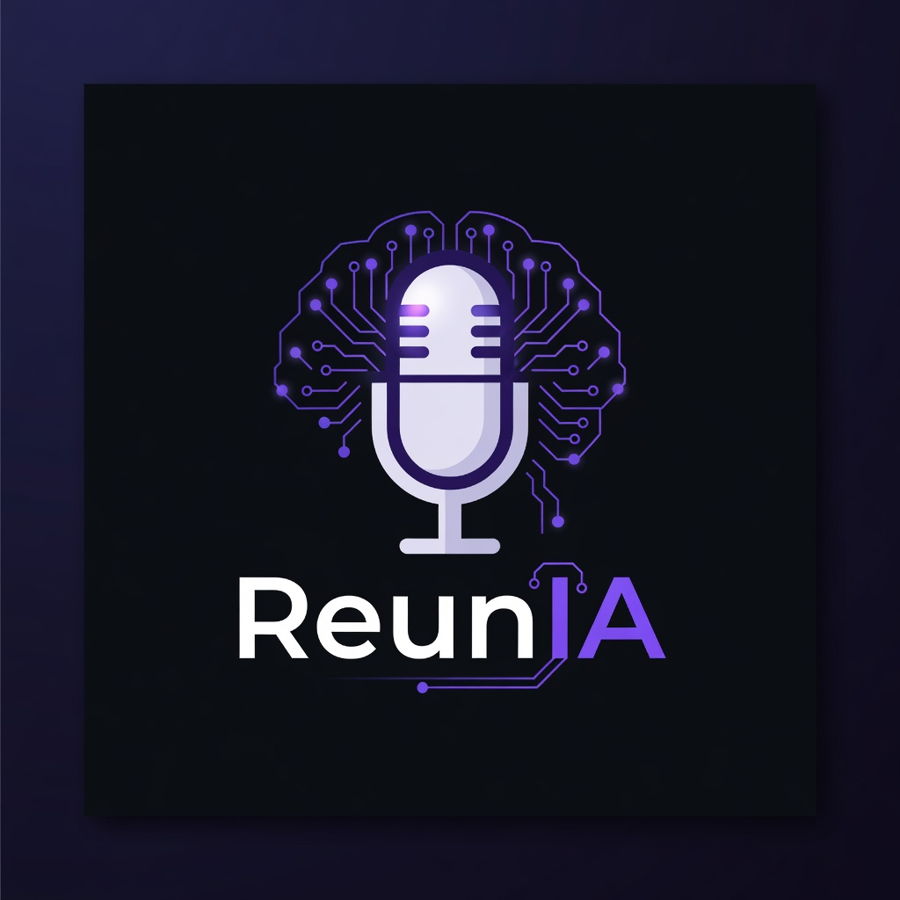

# ReunIA

<div align="center">
  
  <br><br>
  <h3>Grabador de reuniones con IA • 100% local</h3>
  <p>
    <a href="https://reunia-pied.vercel.app">🌐 Landing / demo</a> &nbsp;•&nbsp;
    <a href="https://github.com/miguerei/reunia/releases">⬇️ Descargas</a> &nbsp;•&nbsp;
    <a href="docs/PRD.md">📋 PRD / Roadmap</a>
  </p>
</div>

**Un clic (o atajo global) y graba audio del micrófono + del sistema (Google Meet, Zoom, etc.).** La IA genera informes completos: resumen, insights clave, asistentes, recomendaciones, consejos y to-do list.

Todo **local-first**: tus grabaciones y memoria quedan en tu PC. Cada miembro del equipo instala y usa su propia cuenta (OpenAI key personal o su propia instancia de Ollama).

## Instalación con un comando (lo más rápido)

Pega esto en tu terminal — descarga el último release, lo instala y abre la app:

**macOS** (Terminal):
```bash
curl -fsSL https://reunia-pied.vercel.app/install.sh | bash
```

**Windows** (PowerShell):
```powershell
irm https://reunia-pied.vercel.app/install.ps1 | iex
```

## Descarga e instalación manual (alternativa)

1. Ve a la sección **[Releases](https://github.com/miguerei/reunia/releases)** de este repositorio.
2. Descarga el instalador más reciente:
   - **macOS**: `ReunIA-*-arm64.dmg` (Apple Silicon M1/M2/M3/M4) o `ReunIA-*.dmg` (Intel)
   - **Windows**: `ReunIA.Setup.*.exe` (NSIS)
3. Instala como cualquier aplicación normal (doble clic en .dmg → arrastra a Aplicaciones, o ejecuta el .exe).
4. Al abrir por primera vez:
   - La ventana de **Ajustes** se abre automáticamente.
   - Pega tu clave de OpenAI **o** cambia a **Ollama (Local)**.
   - (Opcional) Elige tu carpeta de almacenamiento.

> **⚠️ macOS "ReunIA está dañada" / Gatekeeper**
> Si al abrir la app después de instalar el DMG te aparece el mensaje "ReunIA está dañada y no se puede abrir. Deberías trasladarla a la papelera", es porque los builds actuales todavía no están firmados + notarizados por Apple (problema muy común en Electron).
>
> **Solución rápida (haz esto una sola vez):**
> ```bash
> xattr -cr /Applications/ReunIA.app
> ```
> Luego abre la app con botón derecho → Abrir (la primera vez).
>
> Estamos configurando firma de código + notarización en el pipeline de releases para que esto desaparezca en futuras versiones. Mientras tanto, el comando de arriba resuelve el problema para la mayoría de usuarios.

¡Listo! Cada persona del equipo hace esto de forma independiente en su PC con su propia cuenta y sus grabaciones quedan privadas en su máquina.

> **Nota para macOS (Google Meet / Zoom)**: Para capturar el audio que sale de las videollamadas (no solo tu voz), instala **BlackHole** (gratuito). Instrucciones abajo.

## Requisitos

- **macOS** (Apple Silicon recomendado) o **Windows 10/11**.
- Para OpenAI: una clave API personal (Whisper + GPT). Muy barato (~0,5-2 centavos de dólar por reunión de 30 min).
- Opción 100% local y privada: **Ollama** corriendo en tu máquina (sin enviar nada a internet).

**Captura de audio del sistema (imprescindible para Meet/Zoom):**

- **macOS**: Instala [BlackHole](https://github.com/ExistentialAudio/BlackHole) (gratis). Crea un "Dispositivo multi-salida" o "agregado" en la Utilidad de Audio MIDI que incluya BlackHole + tus altavoces. Luego en ReunIA selecciona ese dispositivo.
- **Windows**: Usa un cable de audio virtual como [VB-Cable](https://vb-audio.com/Cable/) o similar. Configura la reproducción del sistema para que salga también por el cable virtual y selecciona ese dispositivo en ReunIA.

## Características

- Botón grande + atajo global (Cmd/Ctrl + Shift + R) para empezar/parar grabación al instante.
- **Captura dual**: micrófono + audio del sistema mezclados en una sola grabación (elige los dos dispositivos al empezar a grabar) — ideal para videollamadas con varias personas.
- **Coach IA en vivo**: durante la grabación, el botón "Resumen últimos minutos" analiza la conversación reciente y devuelve resumen, tono, sugerencias de mejora en tiempo real, perfil comunicativo del interlocutor y nombres detectados.
- Reproducción inmediata del audio grabado.
- Procesamiento con **OpenAI Whisper** (transcripción en español de alta calidad) + GPT para informe estructurado.
- Informe visual bonito con:
  - Resumen ejecutivo
  - Insights clave
  - Personas asistentes
  - Quiénes intervinieron
  - Recomendaciones
  - Consejos
  - To-Do list editable (checkboxes)
- Guardado organizado en subcarpetas por fecha + tema.
- Exportación fácil (Markdown + JSON + audio + ZIP).
- Bandeja del sistema + persistencia de configuración.

## Para tu equipo (uso multi-usuario)

- Cada miembro **descarga e instala** la app de forma independiente desde los Releases de GitHub.
- Cada uno configura **su propia clave de OpenAI** (o ejecuta su propio Ollama) en Ajustes.
- Las grabaciones, transcripciones, informes y la "memoria de auto-mejora" (RAG local) se guardan **solo en el PC de esa persona**.
- No hay cuentas compartidas ni datos en la nube (salvo que uses OpenAI).
- El atajo global, la bandeja y el modo compact/stealth funcionan por usuario.

Esto permite que diferentes personas del equipo usen la herramienta con sus propias cuentas y sus propios registros sin interferir entre sí.

## Desarrollo / Compilar desde código fuente

Si un miembro del equipo quiere compilar o modificar:

```bash
cd reunia
npm install

# Desarrollo (UI + grabación + IA en vivo)
npm run dev
# En otra terminal:
npx electron dist-electron/main.js
```

Generar instaladores (requiere los iconos en `build/`):

```bash
# macOS universal (Intel + Apple Silicon)
npm run dist:mac

# Windows
npm run dist:win
```

Los artefactos terminados aparecen en la carpeta `release/`. Puedes subirlos manualmente a un nuevo GitHub Release.

> Durante desarrollo se usa MediaRecorder del navegador. La app completa (main process, atajos globales, persistencia real) requiere Electron.

## Estructura de una sesión guardada

Cada usuario tiene su propia carpeta (por defecto `~/Documents/ReunIA` o la que configures):

```
~/Documents/ReunIA/
  2025-06-08_14-30_Reunion-Equipo-Producto/
    audio.webm
    metadata.json          # incluye liveQAs (preguntas durante la reunión) + estrellas para memoria
    transcript.txt
    report.json
    informe.md             # versión bonita en Markdown lista para compartir
```

## Soporte local (Ollama) y transcripción privada

En **Ajustes** puedes cambiar el proveedor de IA en cualquier momento:

- **OpenAI** — mejor calidad (recomendado al principio).
- **Ollama (Local)** — 100% en tu máquina. Requiere Ollama instalado y corriendo (`ollama serve`).

**Pasos Ollama:**
1. Instala Ollama desde https://ollama.com
2. `ollama pull llama3.2` (o un modelo mejor para español como gemma2 o qwen2.5)
3. En ReunIA → Ajustes → elige "Ollama (Local)" + tu URL (normalmente `http://localhost:11434`) y el modelo.

También puedes usar endpoints locales compatibles con la API de OpenAI para la transcripción (whisper-asr-webservice, faster-whisper, etc.) marcando "Local (compatible OpenAI)".

Esto permite flujos **completamente privados** sin enviar audio ni texto a terceros.

## Notas técnicas

- Electron + React 19 + TypeScript + Tailwind + Zustand.
- Grabación con MediaRecorder (multiplataforma) + buffer rolling para preguntas en vivo.
- Dual provider: OpenAI o Ollama (`/api/chat` + `format: json` para informes estructurados).
- Memoria local de auto-mejora (RAG): las respuestas marcadas con ★ + insights de informes se indexan y se inyectan en futuras preguntas e informes (con soporte opcional de embeddings de Ollama).
- Modos de baja distracción: Compacto (pill), Stealth (placeholder oculto), + ventana PiP always-on-top de ~340px.
- Atajos globales, bandeja del sistema, power-save blocker.

## Contribuir / Compilar releases

Ver sección "Desarrollo / Compilar desde código fuente" arriba.

Para crear un release oficial para el equipo:
1. Compila con `npm run dist:mac` y/o `npm run dist:win`.
2. Ve a GitHub → Releases → "Draft a new release".
3. Sube los archivos generados en `release/`.
4. Publica. El equipo descarga los instaladores directamente.

---

Listo para uso en equipo. Cada persona instala en su PC, configura su propia cuenta (OpenAI key o Ollama) y todas sus grabaciones + memoria quedan locales. 

Si necesitas mejoras (mejor waveform siempre visible, export DOCX/PDF, más robustez en Windows, auto-updater, firma de instaladores, etc.) avísame.
